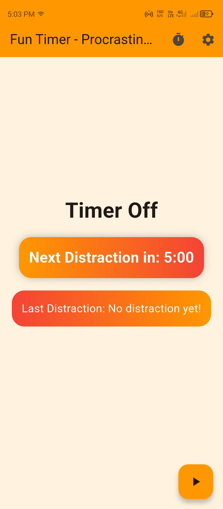
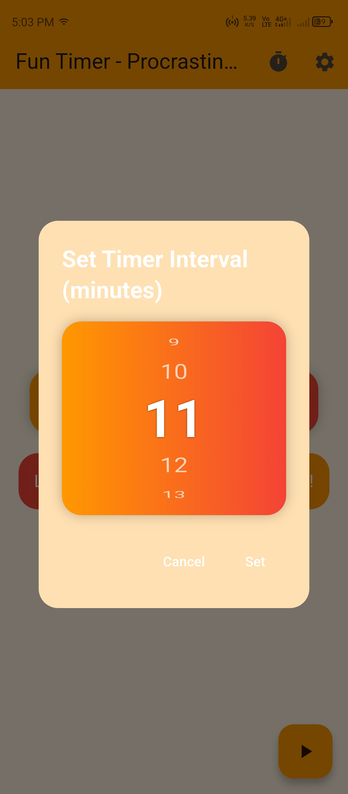

# Fun Timer ⏰

**Fun Timer – Procrastination Timer App**  
_Flutter · AdMob · Notifications_  
A playful Flutter app that nudges you to procrastinate with timed notifications and hilarious excuses! Set custom intervals with a sleek, rotatable wheel, add your own excuses, and enjoy a vibrant Material 3 UI with orange/red gradients, pulsing animations, and rounded corners. Monetized with AdMob banner and interstitial ads, it’s perfect for a lighthearted break. (MVP completed)  
_GitHub:_ [github.com/deepdarji/Fun-Timer](https://github.com/deepdarji/Fun-Timer)

---

## ✨ Features

- 🎨 **Vibrant UI**: Material 3 design with orange/red gradients, shadows, and pulsing animations for a fun, modern look.
- ⏲️ **Custom Timer**: Set intervals (1-30 minutes) via a cool, rotatable wheel picker on the main screen.
- 😂 **Random Excuses**: Get random default or custom excuses via timed notifications (foreground and background).
- 📝 **Custom Excuses**: Add your own excuses in the settings screen for personalized procrastination.
- 📱 **Responsive Design**: Adapts to any screen size with system-based dark/light theme support.
- 💸 **AdMob Integration**: Banner ads on the home screen and interstitial ads in settings (test IDs included).
- 🔔 **Notifications**: Foreground and background notifications with Workmanager for reliable timing.
- 📷 **Custom Icon**: Supports custom app icon generation with `flutter_launcher_icons`.

## 📸 Screenshots

| Home Screen                     | Timer Set Screen                |
| ------------------------------- | ------------------------------- |
|  |  |

## 🚀 Setup

1. **Clone the Repo**

   ```bash
   git clone https://github.com/deepdarji/Fun-Timer.git
   ```

2. **Install Dependencies**

   ```bash
   flutter pub get
   ```

3. **Add App Icon**

   - Place a 512x512 or 1024x1024 `icon.png` in `assets/images/`.
   - Generate icons:
     ```bash
     flutter pub run flutter_launcher_icons
     ```

4. **Configure AdMob**

   - Get your AdMob App ID from [AdMob Console](https://apps.admob.com/).
   - Replace test ad unit IDs in `lib/screens/home_screen.dart` and `lib/screens/settings_screen.dart`:
     - Banner: `ca-app-pub-3940256099942544/6300978111`
     - Interstitial: `ca-app-pub-3940256099942544/1033173712`
   - Update platform-specific files:
     - **Android**: Add to `android/app/src/main/AndroidManifest.xml`:
       ```xml
       <uses-permission android:name="android.permission.INTERNET"/>
       <uses-permission android:name="android.permission.POST_NOTIFICATIONS"/>
       <uses-permission android:name="android.permission.FOREGROUND_SERVICE"/>
       <application>
           <meta-data
               android:name="com.google.android.gms.ads.APPLICATION_ID"
               android:value="YOUR_ADMOB_APP_ID"/>
       </application>
       ```
     - **iOS**: Add to `ios/Runner/Info.plist`:
       ```xml
       <key>GADApplicationIdentifier</key>
       <string>YOUR_ADMOB_APP_ID</string>
       <key>UIBackgroundModes</key>
       <array>
           <string>fetch</string>
           <string>remote-notification</string>
       </array>
       ```

5. **Configure Notifications**

   - **Android**: Ensure `POST_NOTIFICATIONS` permission is granted (Settings > Apps > Fun Timer > Notifications).
   - **iOS**: Grant notification permissions when prompted.
   - Disable battery optimization for background tasks:
     - Android: Settings > Apps > Fun Timer > Battery > Unrestricted.

6. **Build the App**

   - Android: `flutter build apk --release`
   - iOS: `flutter build ios --release` (requires Mac and Xcode)

## 📖 About

Fun Timer is a lighthearted Flutter app that encourages procrastination with timed notifications delivering funny excuses. Set custom intervals with a rotatable wheel, add your own excuses, and enjoy a vibrant UI with orange/red gradients and animations. With AdMob monetization and background notifications via Workmanager, it’s both fun and functional for users who love a good laugh while “working.”

## 📦 Packages

- `flutter_local_notifications: ^17.2.3` – Foreground/background notifications
- `workmanager: ^0.10.0` – Background task scheduling
- `shared_preferences: ^2.3.2` – Persist timer state and custom excuses
- `google_mobile_ads: ^5.1.0` – Banner and interstitial ads
- `wheel_chooser: ^0.1.1` – Rotatable timer interval picker
- `flutter_launcher_icons: ^0.14.1` – App icon generation
